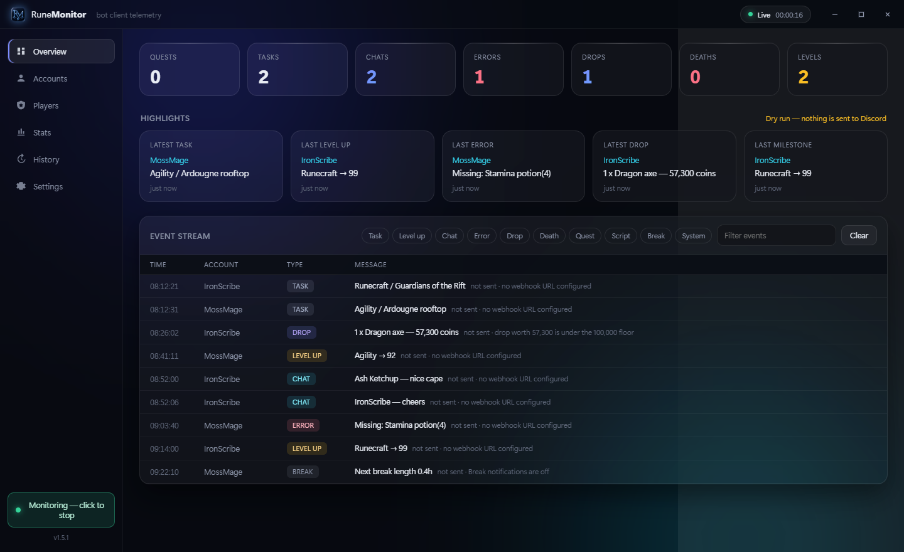
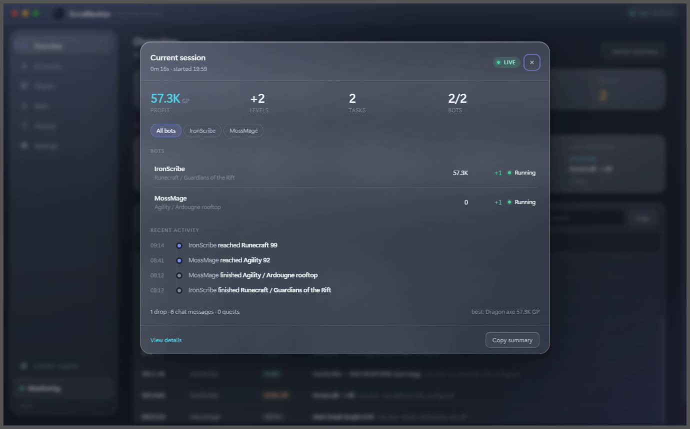
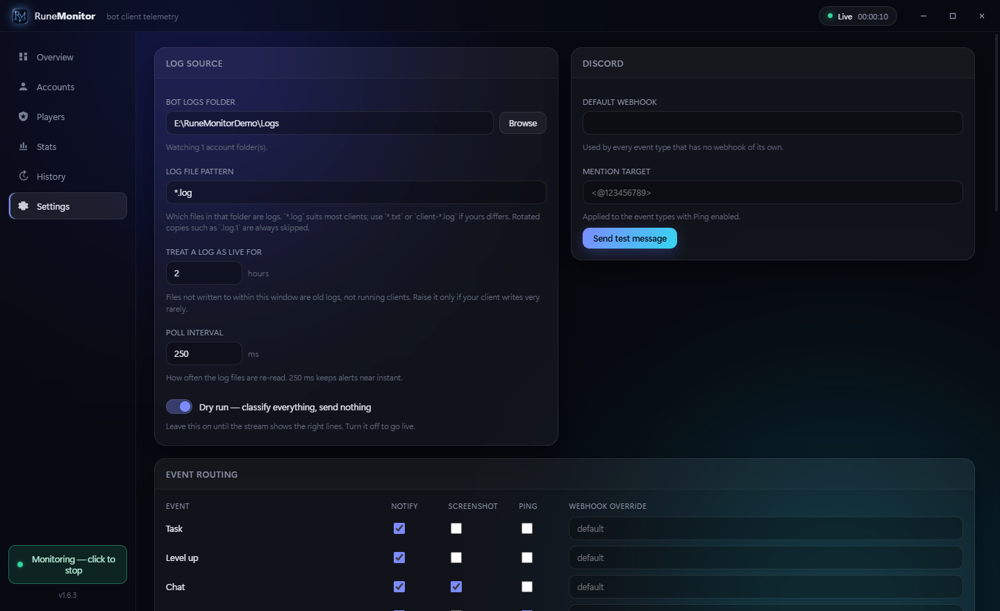
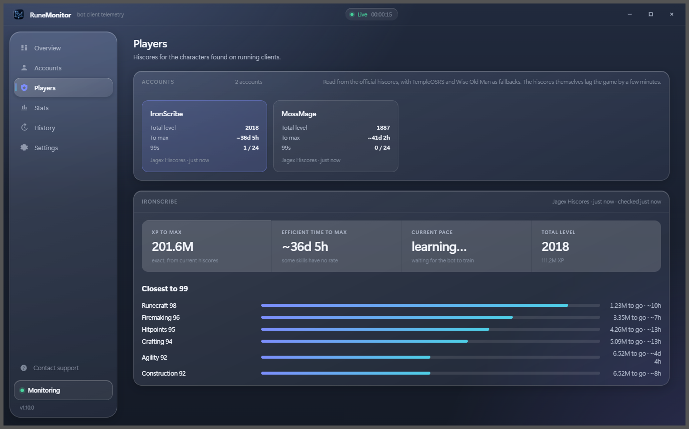
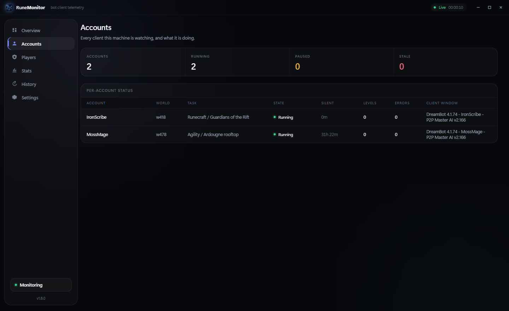
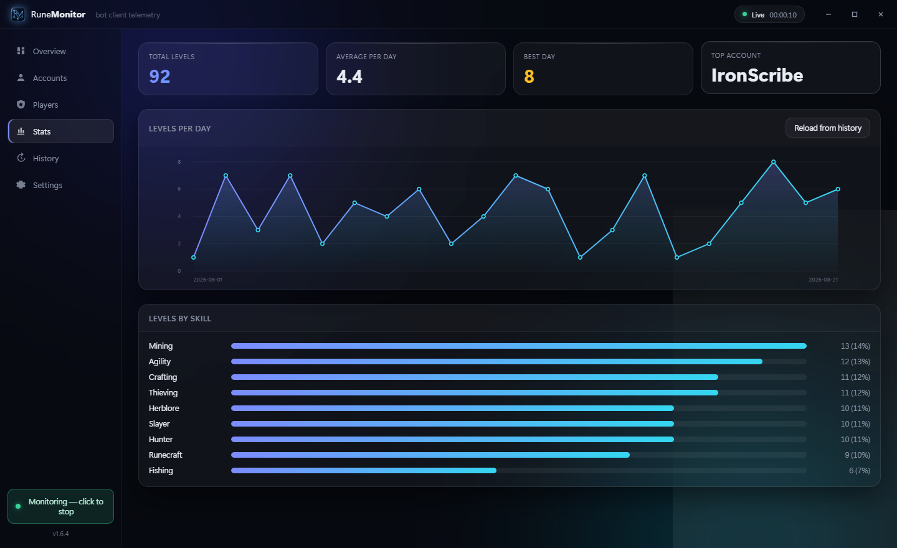
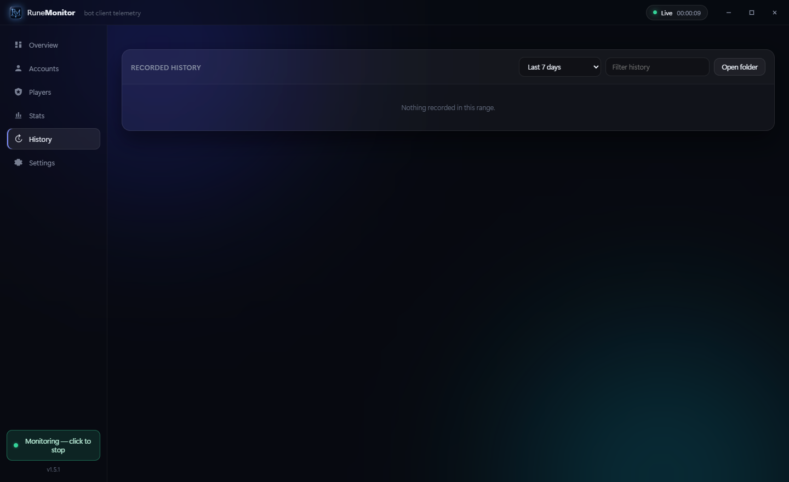

  

Watches your bot client's log folder and sends you a Discord message when something worth
knowing happens — a level milestone, the script pausing or dying, a valuable drop, someone
talking to your bot, or the bot going quiet.

It reads log files and nothing else. It never touches the game, never types, never clicks.

## What it does

**Reads any client's logs.** The file pattern, the line format and the wording it looks for are
all settings. Four line shapes work out of the box — `2026-08-18 11:37:31 [INFO] text`,
`[11:37:31] INFO text`, `11:37:31 INFO - text` and ISO timestamps — and a line matching none of
them still shows up, stamped with its arrival. Rotated copies (`.log.1`, `.log.2026-08-19`,
`.log.gz`) are skipped.

**Classifies instead of grepping.** Every line becomes one of ten event types — task, level up,
chat, error, drop, death, quest, script, break, system — with the skill, level and coin value
pulled out of it.

**Routes each type on its own.** Per type: whether it notifies at all, whether it carries a
screenshot of the client window, whether it pings you, and which Discord channel it lands in.

**Knows a 99 from a 43.** Notify every Nth level, never below a floor, and a milestone list that
overrides both — so 99s always arrive while the grind stays quiet.

**Tells you how this run is going.** One button on the Overview opens the current session: how
long it has been running, what it earned, which bot earned it, every level gained and from what,
the drops worth reading, the tasks and quests finished, the chat it had, and a timeline of the
lot. Current session only — the History and Stats tabs still answer the lifetime questions.

**Notices when nothing happens.** A watchdog fires when an account stops writing lines at all,
which is what a crashed, stuck or logged-out bot looks like from the outside.

**Pings you when a bot stops earning.** Script stopped or paused, logged out, disconnected, or a
log gone silent — one switch, whatever the per-type Ping boxes say. A second switch does the same
for the bot answering someone in chat.

**A ping that actually pings.** Discord notifies on numeric IDs, never on names: a message saying
`<@yourname>` is delivered as plain text and nobody is told. RuneMonitor says so where you type
it, rather than sending a mention that quietly reaches no one.

**Screenshots the client**, even when its window is behind something else, and attaches the
image to the alert. A failed capture never suppresses the alert.

**Tracks several accounts at once**, discovered as their logs appear — one folder per account or
one flat folder, both work.

**Keeps history on disk** so restarts do not lose it, and charts levels per day and per skill.

**Drops are filtered by worth.** A bot killing for hours drops the same 20k rune over and over,
so a coin floor decides which ones reach Discord. Untradeables carry no price and have their own
switch.

**Players follow themselves.** A character found on a running client is tracked automatically,
and its hiscores are re-read whenever you open the Players view or select it: hours to max,
total level, and the skills closest to 99.

**The bot's own chat is caught.** When a script's reply feature answers someone, the message and
the reply travel to Discord as one card — including the replies the script decides not to send,
which it logs as a bare `BAD RESPONSE (too long)`. A line that reads like conversation but that
no pattern claims is called out in the stream instead of being dropped, and Settings has a scan
that reports what a log's chat actually looks like.

**Accounts are named by the client that writes the log**, not by whichever client started at
about the same time — two clients opened seconds apart used to be able to swap names. When a
name still has to be inferred, the stream says so.

**One filter at a time.** The stream shows everything by default. Click a counter or a chip to
see that kind alone, click another to switch to it, click the same one again to go back to
everything.

**Nothing to arm.** An event type with a webhook sends; one without says so in the stream. There
is no separate live switch to leave off by accident.

**English only.** There is no language setting, and numbers, dates and dialogs stay English on a
machine set to any other language.

## Install

1. Download `RuneMonitor-vX.Y.Z.zip` from the [latest release](../../releases/latest).
2. Unzip it anywhere and run `RuneMonitor.exe`.
3. Windows 10 and 11 already have what it needs. Nothing is installed; it writes only to
   `%APPDATA%\RuneMonitor`.

## First run

1. It offers the log folder of whichever client it finds — DreamBot, OSBot, TRiBot, RuneLite,
   Microbot or Powbot. Use **Browse** for anything else.
2. Under **Settings**, paste a Discord webhook URL and press **Send test message**.
   (Discord: Server Settings → Integrations → Webhooks → New Webhook → Copy URL.)
3. Watch the event stream. Every row says whether it was sent, and why not when it was not —
   a level under the floor, a drop under the coin floor, or no webhook for that type yet.

## Players

Every character running on a client appears here on its own — nothing to type, nothing to
switch on. Opening the view, or picking an account, re-reads the hiscores, so the figures are
current: hours to max, total level, how many 99s are done, and the skills closest to finishing,
ordered by the experience actually left rather than by level.

## Accounts

State, how long each account has been silent, levels and errors so far, and which window title
its screenshots come from.

## Stats and history

Levels per day and per skill, merged from the running session and everything recorded earlier.

History is written as one file per account per day and stays searchable after a restart.

## Tuning it to your client

Game messages — levels, drops, deaths, chat — are written by the game itself, so those patterns
work in every client. The task, activity and script lifecycle lines come from your client or
script, and those live under **Settings → Client profile**: edit the pattern, or press **Reset
to defaults** if an edit goes wrong.

**Custom rules** cover anything the classifier does not: a substring or a regular expression, an
optional numeric threshold, a per-account cooldown, its own message and channel. **Replay a log
file** runs an existing log through those rules and reports what would have fired, without
sending anything.

## Updates

Each launch asks this repository for the newest release and offers you the download page if it
is newer. Nothing is downloaded or installed behind your back, and the check stays silent when
GitHub is unreachable.
