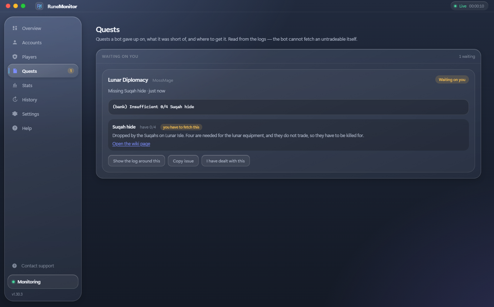
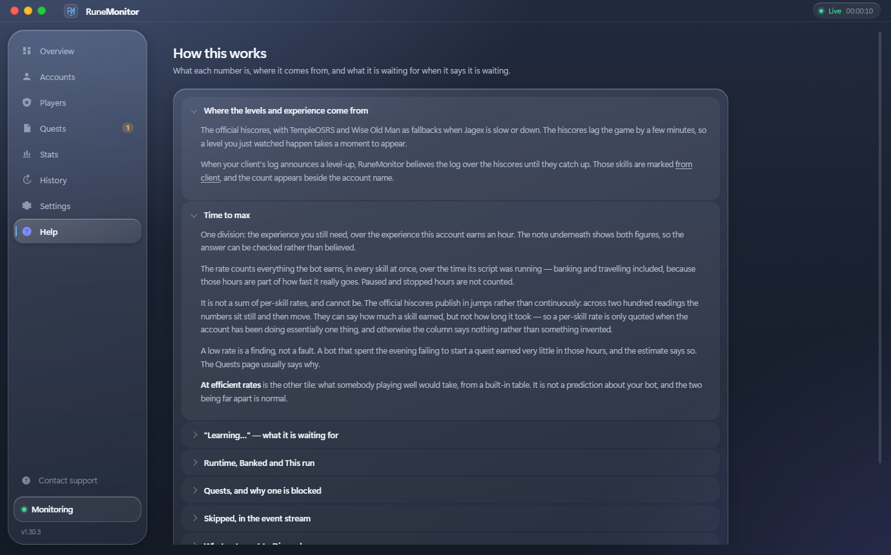

<p align="center">
  
</p>

<p align="center">
  <a href="https://github.com/urgehn/RuneMonitor/releases/latest"></a>
  <a href="https://github.com/urgehn/RuneMonitor/releases"></a>
  
</p>

# RuneMonitor

A Windows app that watches your OSRS bot clients so you don't have to sit and stare at them.
Point it at the folder your client writes logs to. You get a live view of every account, and a
Discord message when something happens that you'd actually want to know about: a level, a good
drop, someone talking to your bot, a script that died, an account that went quiet.

Works with **DreamBot** and with **BotClient**, and with anything else that keeps a log. I built
it around DreamBot running P2P Master AI because that is what I run, then added BotClient when I
moved over. The patterns it matches are settings rather than hardcoded strings, so a client I
have never seen works too once you point it at the right wording.

BotClient prints its log to a console window and writes no file at all. RuneMonitor reads that
console for it, so nothing extra to install and nothing to run by hand. There is a
[short setup below](#setting-up-with-botclient).

It only reads log files. No injection, no input, nothing sent to the game.

**[Download the latest release](https://github.com/urgehn/RuneMonitor/releases/latest)**


## Reading logs

Every line gets parsed into an event: task, level up, chat, error, drop, death, quest, script,
break or system. The skill, the level and the coin value come out of the line with it, so you
can filter and count on them later.

Four timestamp formats work without any setup:

```
2026-08-18 11:37:31 [INFO] text
[11:37:31] INFO text
11:37:31 INFO - text
2026-08-18T11:37:31Z INFO text
```

A line that matches none of them still shows up in the stream, stamped with the time it arrived.
Rotated copies (`.log.1`, `.log.2026-08-19`, `.log.gz`) get skipped so you don't replay last
week every time you open the app.

## Discord

Each event type is routed on its own. You choose whether it notifies at all, whether it carries
a screenshot of the client window, whether it pings you, and which channel it goes to. So level
ups can land in one channel and errors in another, and chat can ping you while drops don't.

Levels have a floor and a milestone list. Set the floor to 90 and every 99 still arrives while
the grind underneath stays quiet.

Drops are filtered by value, because a bot killing for six hours drops the same 20k rune item
over and over. Untradeables have no price at all, so they get their own switch.

One thing worth knowing about pings: Discord only notifies on numeric IDs, never on names. A
message containing `<@yourname>` shows up as plain text and nobody gets pinged. The settings
page tells you this where you type it in, instead of silently sending a mention that reaches
nobody.

## The current session

There's a button on the Overview that opens what this run has done: how long it's been going,
what it earned, which bot earned it, every level gained and from what, the drops worth reading,
tasks and quests finished, the chat it had, and a timeline of all of it.

This one is deliberately about the current session only. History and Stats answer the lifetime
questions.


## Quests it gave up on

When a script can't finish a quest it locks it and moves on to something else. The reason is one
line in the log and it scrolls away in seconds, which is annoying when you find out days later
that a bot has been skipping the same quest all week.

RuneMonitor keeps that moment: what was missing, how many you were short, whether it's something
the bot could have bought (an untradeable it can't), where the item comes from, and a link to
the wiki page. "Show the log around this" pulls the surrounding lines back out of the log file
itself, however long ago it happened and however many times the log has rolled since.



## When a bot stops

A watchdog fires when an account stops writing lines at all. That's what a crashed, stuck or
logged-out client looks like from the outside, and it's usually the thing you most want to hear
about.

There's a separate switch for "this bot stopped earning": script stopped or paused, logged out,
disconnected, or the log went silent. It overrides the per-type ping boxes, because if a bot has
been dead for two hours you want to know regardless of how you set up notifications. A second
switch does the same for your bot answering someone in chat.

## Everything else it does

* Screenshots the client window and attaches it to the alert, even when the window is behind
  something else. If the capture fails the alert still goes out.
* Tracks several accounts at once, picking them up as their logs appear. One folder per account
  or one flat folder, both work.
* Names accounts from the client that actually writes the log rather than from whichever client
  started around the same time. Two clients opened seconds apart used to be able to swap names.
  When a name still has to be guessed, the stream says so.
* Keeps history on disk, one file per account per day, so a restart doesn't lose it.
* Charts levels per day and per skill.
* Follows the characters it finds on running clients and re-reads their hiscores when you open
  the Players view: hours to max, total level, and the skills closest to 99.
* Catches your bot's own chat. When a script's reply feature answers someone, the message and
  the reply arrive as one card, including the replies the script decided not to send (it logs
  those as a bare `BAD RESPONSE (too long)`). A line that reads like conversation but matches no
  pattern gets called out in the stream instead of being quietly dropped, and there's a scan in
  Settings that shows you what a log's chat actually looks like.
* Filters the stream one kind at a time. Click a counter or a chip to see just that kind, click
  another to switch, click the same one again to go back to everything.
* Has no separate "live" switch to forget to turn on. An event type with a webhook sends. One
  without says so in the stream.
* English only. There's no language setting, and numbers, dates and dialogs stay English on a
  machine set to something else.

## Where the numbers come from

The Help tab explains the figures rather than just showing them: where levels and experience are
read from, what "time to max" divides by, what it's waiting for when it says it's still
learning, why a quest is blocked, what reaches Discord and what doesn't, and where the app keeps
your data.



## Install

1. Grab `RuneMonitor-vX.Y.Z.zip` from the [latest release](../../releases/latest).
2. Unzip it anywhere and run `RuneMonitor.exe`.
3. Windows 10 and 11 already have everything it needs. There's no installer. It writes to
   `%APPDATA%\RuneMonitor` and nowhere else.

## Setting up with BotClient

BotClient never writes a log file. It prints everything to a console window it makes itself, so
there is nothing on disk for a monitor to read. RuneMonitor reads that console instead, one
reader per client, and writes it into a folder it then watches like any other client's logs.

1. Unzip the release somewhere and run `RuneMonitor.exe`. `RuneBridge.exe` sits beside it and
   updates with it. You never run that one yourself.
2. **Settings, Log source.** Set the log folder to something empty of your own, for example
   `Documents\RuneMonitorLogs`. Turn on **Read clients that write no log file**, just under Poll
   interval, and press Save settings.
3. **Settings, Client profile.** Paste this into **Client window title**, which teaches it the
   shape of a BotClient window so screenshots and names land on the right bot:

   ```
   ^(?:(?<client>BotClient)\s+-\s+(?<script>\S+)\s+-\s+(?<name>.+)|(?<client>DreamBot[^-]*?)\s+-\s+(?<name>[^-]+?)\s+-\s+(?<script>.+))$
   ```

   That one covers BotClient and DreamBot together, so you can run both.
4. Paste a Discord webhook under **Discord** and press **Send test message**.
5. Start your clients. Each one turns up within a few seconds, named after the character playing
   on it, and its reader closes when you close RuneMonitor.

**What you get from BotClient:** tasks, script state, breaks, errors, and an alert when a bot
stops earning or gets stuck at the login screen.

**What you do not:** drops, chat and pets. BotClient does not put game messages in its log at
all, so nothing can read them out of it. Levels still work, because the Players page reads those
from the hiscores rather than from the log. DreamBot writes all of it, if that matters to you.

## First run

1. It suggests the log folder of whichever client it finds: DreamBot, OSBot, TRiBot, RuneLite,
   Microbot or Powbot. Use **Browse** for anything else.
2. In **Settings**, paste a Discord webhook URL and hit **Send test message**. (Discord: Server
   Settings, Integrations, Webhooks, New Webhook, Copy URL.)
3. Watch the stream. Every row tells you whether it was sent, and if not, why: a level under the
   floor, a drop under the coin floor, or no webhook set for that type yet.


## Players

Every character running on a client shows up here by itself. Nothing to type, nothing to enable.
Opening the view or picking an account re-reads the hiscores, so what you're looking at is
current: hours to max, total level, how many 99s are done, and the skills closest to finishing,
sorted by experience left rather than by level.


## Accounts

State, how long each account has been silent, levels and errors so far, and which window title
its screenshots are coming from.


## Stats and history

Levels per day and per skill, from the running session and everything recorded before it.


History is one file per account per day and stays searchable after a restart.


## Making it fit your client

Game messages (levels, drops, deaths, chat) are written by the game, so those patterns work in
any client. Task, activity and script lifecycle lines come from your client or script, and those
live under **Settings, Client profile**. Edit the pattern, or hit **Reset to defaults** if you
break something.

For anything the classifier doesn't cover there are custom rules: a substring or a regex, an
optional numeric threshold, a per-account cooldown, its own message and channel. **Replay a log
file** runs an old log through those rules and reports what would have fired, without sending
anything.

## Updates

Each launch asks this repo for the newest release. If there's one, it offers it. Nothing is
downloaded or installed behind your back, and if GitHub is unreachable the check stays quiet.
